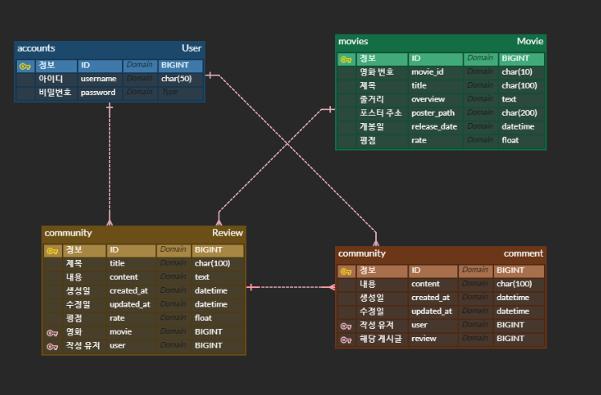
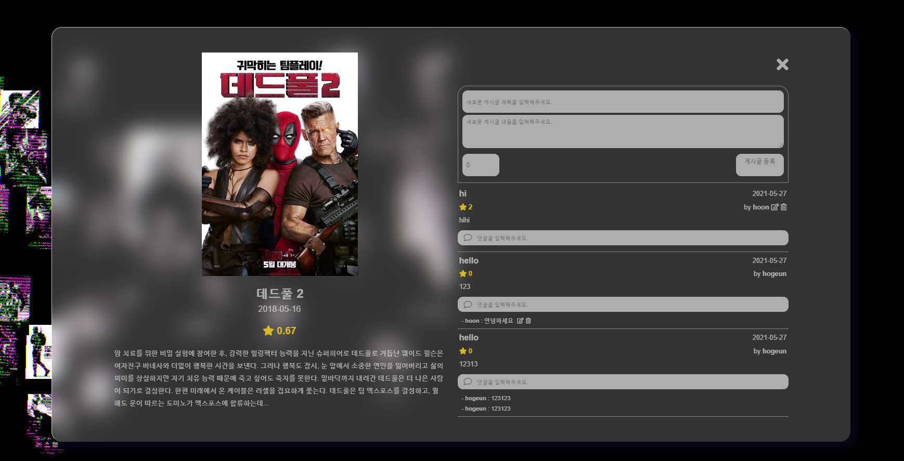
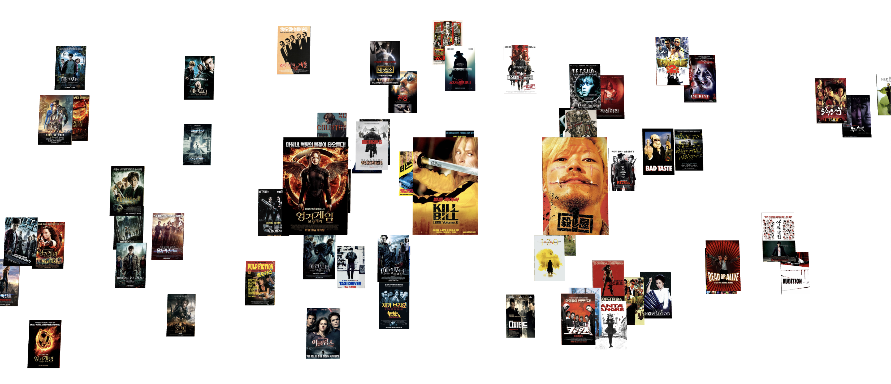

# three.js를 활용한 3차원 영화 추천 사이트 


> 프로젝트 개요 : 2인 팀 프로젝트
>
> 프로젝트 기간 : 2021.05.20 ~ 2021.05.28
>

<br>

## Table of Contents

1. [개발환경](#개발환경)
2. [주요 프레임워크 및 라이브러리](#주요-프레임워크-및-라이브러리)
3. [특징 a) ERD 및 movie 데이터](#특징-a-ERD-및-movie-데이터)
4. [특징 b) three.js](#특징-b-threejs)
5. [특징 c) 모달 창으로 구현한 영화 상세 페이지](#특징-c-모달-창으로-구현한-영화-상세-페이지)
6. [특징 d) async-await 비동기 처리](#특징-d-async-await-비동기-처리)
7. [업무 분담](#업무-분담)
8. [느낀점](#느낀점)

<br><br>

## 개발환경

* macOS Big Sur 11.3.1 & Windows 10
* Visual Studio Code 1.57.0
* Python 3.8.6
* Node.js 14.16.1

<br><br>

## 주요 프레임워크 및 라이브러리

* Django 3.2.3
* Django REST Framework 3.12.4
* Vue.js 2.6.11
* three.js 0.128.0

<br><br>

## 특징 a) ERD 및 movie 데이터



영화 검색과 추천은 모두 **TMDB API**를 사용하기 때문에 **movies 테이블은 최초에 빈 테이블입니다.**

movies 테이블이 사용되는 순간은 사용자가 별점을 매기거나 리뷰를 남기는 등의 행위를 할 때입니다.

**따라서 사이트의 영화 상세 페이지에 접속하는 순간, 클라이언트는 영화 정보를 request body에 담아 서버에 조회 요청을 보내고, 서버는 상황에 따라 두가지 다른 경로로 응답을 보내옵니다.**

1. 만약 DB에 해당 영화의 레코드가 있다면, 바로 DB에서 레코드를 불러와 응답 메시지에 담아 전송합니다.
2. 하지만 DB에 해당 영화의 레코드가 없다면, 먼저 TMDB 서버에 영화 데이터를 요청하고, 응답 받은 데이터를 DB에 저장하고 동시에 DB에 저장한 데이터를 응답 메시지에 담아 전송합니다.

<br>

> 영화 검색과 추천 기능은 [**TMDB API**](https://developers.themoviedb.org/3)를 사용했습니다.
>
> [](https://developers.themoviedb.org/3)

<br>

아래는 관련된 [View 함수 코드](https://github.com/rootkwak528/BE-ssafy-final-pjt/blob/master/movies/views.py)입니다.

> Django는 MVC 패턴의 변형인 MTV 패턴을 사용하기 때문에 여기서 View는 MVC 패턴의 Controller에 해당합니다.

```python
# BE/movies/views.py

@api_view(['POST'])
def movie_create(request):

    movie_id = request.data.get('id')
    movie = Movie.objects.filter(movie_id=movie_id)

    # 영화 정보가 DB에 없는 경우 DB에 저장
    if not movie.exists():
        movie_data = {
            'movie_id': movie_id,
            'title': request.data.get('title'),
            'overview': request.data.get('overview'),
            'release_date': request.data.get('release_date'),
            'poster_path': request.data.get('poster_path'),
        }
        
        serializer = MovieSerializer(data=movie_data)
        if serializer.is_valid(raise_exception=True):
            serializer.save()
            return Response(serializer.data)

    # 영화 정보가 DB에 있는 경우 DB에서 데이터 로드
    else:
        try:
          	# 리뷰와 댓글 데이터도 한번에 반환하여 DB 요청 횟수 최적화
            reviews = Review.objects.select_related('user')
            comments = Comment.objects.select_related('user')

            movie = Movie.objects.prefetch_related(
                Prefetch('reviews', queryset=reviews),
                Prefetch('reviews__comments', queryset=comments)
                ).get(pk=movie[0].pk)

        except:
            return Response(status=status.HTTP_404_NOT_FOUND)

        serializer = MovieSerializer(movie)
        return Response(serializer.data, status=status.HTTP_200_OK)
```

<br><br>

## 특징 b) three.js

[](https://threejs.org/)

**[three.js](https://threejs.org/)는 WebGL 엔진에 기반한 JavaScript 3D library로, 훌륭한 [공식 문서](https://threejs.org/docs/index.html#manual/en/introduction/Creating-a-scene)와 [다양한 레퍼런스](https://threejs.org/examples/)를 갖고 있습니다.**

three.js는 3차원 공간을 구현하기 위해 일반적인 웹에서 사용되지 않는 개념들을 다수 포함하고 있습니다.

라이브러리는 객체지향적으로 작성되었으며, 가장 주요한 세가지 객체는 Scene, Camera, Renderer입니다.

먼저, Scene은 화면에 표시하고자 하는 모든 3차원 객체를 포함하는 객체입니다.

Camera는 실시간으로 Scene을 촬영하는 객체로서 Controller를 통해 사용자의 입력에 따라 움직이도록 구현할 수 있습니다.

마지막으로 Renderer는 Camera가 촬영한 장면을 클라이언트 화면에 출력하는 객체입니다.

<br>

아래는 본 프로젝트에서 작성된 **[three.js 코드](https://github.com/rootkwak528/FE-ssafy-final-pjt/blob/master/src/views/movies/MovieRecommend.vue)의 개략적 의사코드입니다.**

``` 
init()

// three.js 초기화
function init () {

	씬 생성
	카메라 생성
	렌더러 생성
	
	// 웹 화면에 출력하기 위함
	DOM에 렌더러 추가
	
	조명 및 3D 메쉬 생성
	씬에 조명 및 3D 메쉬 추가
	
  // 사용자 인풋에 반응하기 위함
	컨트롤러 생성
	씬에 컨트롤러 추가
	
	animate()
	
}

// three.js 애니메이션 생성
// 비동기로 작동하는 requestAnimationFrame()를 재귀적으로 호출하기 때문에 (이론 상 60 calls/s)
// 사용자 인풋이나 데이터 변화를 거의 실시간으로 반영할 수 있습니다.
// - requestAnimationFrame()은 Web API의 내장함수입니다.
function animate () {

	requestAnimationFrame( animate )
	
}
```

<br><br>

## 특징 c) 모달 창으로 구현한 영화 상세 페이지

최초에는 영화 상세 페이지를 별도 url로 라우팅하여 구현하려 했습니다.

3차원 상의 영화 추천 목록을 돌아다니다 영화 카드를 클릭하면 상세 페이지로 넘어가는 방식이었습니다.

그러나 이렇게 되면 **상세 페이지에 방문했다 영화 추천 페이지로 되돌아올 때 3차원 Scene이 초기화되는 문제가 있었습니다.**

이는 UX 측면에서는 사용자가 탐색을 반복해야 하기 때문에 낭비를 발생시키는 큰 문제였습니다.

<br>

데이터를 유지하려면 두가지 옵션이 가능해보였습니다.

클라이언트에 임시로 데이터를 저장하거나, 서버에 데이터를 저장하는 방식이었습니다.

하지만 3차원 Scene을 모두 유지하려면 문자열로 1천만~ 수억 사이즈였는데, 클라이언트 로컬 스토리지 최대 사이즈인 5MB를 초과하는 사이즈였습니다. (출처 : https://web.dev/storage-for-the-web/)

또한 서버에 비정형 데이터를 저장하려면 SQLite 외에 새로운 DB를 추가해야 하고, 상세 페이지에 방문할 때마다 수십~수백 MB의 큰 데이터를 주고받아야 한다는 문제점이 있었습니다.

<br>

결론적으로 사용자 입장에서도 익숙한 **모달창으로 상세 페이지를 구현해, url 이동을 없애고 Scene 데이터를 보존했습니다.**

<br>



> 모달창으로 구현된 영화 상세 페이지의 모습.
>
> 모달창으로 바꾸고 또 좋았던 점은 연습 삼아 구현한 후처리 기능을 포함시킬 수 있었다는 점입니다. 덕분에 모달창 뒤의 3차원 영화 추천 목록을 다크모드처럼 표현해 화면 전환 효과를 더 극대화했습니다.

<br><br>

## 특징 d) async-await 비동기 처리

**axios**는 비동기적으로 요청과 응답을 처리해주는 **Promise** 기반의 함수로, 일반적인 경우라면 **axios**를 도입하는 것만으로 비동기를 처리하기 부족함이 없을 것입니다.

하지만 이 프로젝트에서는 **vuex**와 **three.js**를 도입했기 때문에 **axios**와 데이터가 서로 다른 파일에 위치하면서 작동이 틀어졌습니다. **axios**는 **vuex**의 `index.js` 에서 실행됐지만, 바꿔야 하는 데이터는 추천 컴포넌트 파일 내에 위치하고 있습니다.

<br>

다른 컴포넌트에서 사용하는 일이 없기 때문에 데이터를 **state**로 처리하는 것은 비효율적이었습니다. 따라서 기존의 코드도 헤치지 않고 간단히 **async-await**로 **dispatch** 코드를 비동기 처리하여 문제를 해결했습니다.

이 예시 외에도 다양한 코드에서 이와 같이 비동기 처리를 실시해 오류를 피해갈 수 있었습니다.


> **axios**만 사용하면, 응답을 받기 전에 데이터를 확인하고 3D 씬을 구성하기 때문에 추천 목록이 표시되지 않습니다.

<br>



> **async await** 코드를 추가하자, HTTP 응답과 데이터 확인이 비동기적으로 일어나 3D 씬이 올바르게 생성되었습니다.

<br>

아래는 관련된 [컴포넌트](https://github.com/rootkwak528/FE-ssafy-final-pjt/blob/master/src/views/movies/MovieRecommend.vue)와 [vuex](https://github.com/rootkwak528/FE-ssafy-final-pjt/blob/master/src/store/index.js)의 코드 일부분입니다.

```js
// FE/src/views/movies/MovieRecommend.vue

async recommend ( movieId, position ) {

  await this.getRecommends( movieId )

  if ( this.movieRecommends ) {

  	this.updateGeometriesToScene( this.movieRecommends, position )
    
  }
}
```

```js
// FE/src/store.index.js

async getRecommends ({ commit }, movieId) {
  
  const url = `https://api.themoviedb.org/...`
  await axios({
    
    url: url,
    method: 'get',
    
  })
    .then( res => {
    
    if (res.data.results) {
      
      commit('SET_MOVIE_RECOMMENDS', res.data.results)
      
    } else {
      
      commit('SET_MOVIE_RECOMMENDS', null)
      
    }
  })
    .catch( err => {
    
    console.log(err)
    commit('SET_MOVIE_RECOMMENDS', null)
    
  })
},
```

<br><br>

## 업무 분담

| 역할 | 팀원 이름 |                          업무 분담                           |
| :--: | :-------: | :----------------------------------------------------------: |
| 팀장 |  곽호근   | **three.js로 3차원 영화 추천 페이지 구현**<br/>- 영화 카드 제작<br/>- 카드 Texture에 영화 포스터 매핑<br/>- 3차원 상에 카드 배치, 연관성 높은 영화는 가깝게<br/>- 카드 마다 영화 데이터 할당<br/>- 이미지 후처리<br/>**배포** |
| 팀원 |  정훈규   | DB 모델 구축<br/>계정 인증 기능 구현<br/>영화 검색 기능 구현<br/>영화 선택 페이지 구현<br/> 영화 상세 페이지 구현<br/>게시글 CRUD 구현<br/>댓글 CRUD 구현 |

<br><br>

## 느낀점

### 지금까지 중 가장 긴 팀프로젝트

이전에 최장 1일을 넘긴적이 없었지만, 최종 프로젝트인 만큼 일주일 동안 한 프로젝트에 온전히 몰두할 수 있는 좋은 경험이었다.

주제도 자율적으로 정할 수 있었기 때문에 주제를 정하기 전 three.js를 갖고 여러 테스트를 하며 아이데이션한 과정이 가장 기억에 남는다. 처음 사용하는 라이브러리를 바닥부터 이해하며 아이디어를 떠올리고 파트너와 같이 일정과 목표를 구체화했다.

전체적인 계획도 비교적 빠르게 정해졌고, 목표했던 기능도 대부분 구현할 수 있었는데, 아무래도 사전에 기능들을 테스트하며 현실적인 구현 가능성을 미리 스케치했기 때문에 계획대로 진행할 수 있었던 것 같다.

물론 세세한 부분에서 예상치 못한 변수 때문에 조바심을 느끼며, 밤까지 오버페이스를 하는 경우도 종종 있었다. 프로젝트 기간이 더 길어진다면 사전 조사를 더 철저히 실시하고, 예상치 못한 상황을 고려한 일정 상의 버퍼를 잡아야겠다.

<br><br>

### 처음으로 프론트와 백엔드를 나눠서 배포했다.

이전에 토이 프로젝트로 백엔드 따로, 프론트엔드 따로 배포해본 경험은 있지만, 한 프로젝트에서 두 서버를 배포해서 연동되도록 한것은 처음이었다.

몰랐을 때는 프론트엔드와 백엔드가 하나의 도메인으로 배포되는 줄 알았건만, 이렇게 구성되고 있었을 줄이야.

이번에는 프론트엔드 서버를 Netlify에서, 백엔드 서버를 Heroku에서 배포했는데, 다음에는 Docker를 이용해 AWS로 배포해보겠다.

<br><br>

### Oh, my three.js.

디자인과 재학 당시 모델링을 자주 했기 때문에 three.js도 쉽게 사용할 수 있을거라 생각했는데, 반은 맞고 반은 틀린 생각이었다.

전체적인 원리를 이해하기는 수월했지만, GUI가 아닌 코드로 3D를 만든다는 점에서 구현 난이도에 큰 차이가 있었다.

three.js의 잘 갖춰진 공식 문서와 예제들을 참고하여 아이디어를 구체화하고 구현했다는 점에서 큰 뿌듯함을 느꼈다.

다만, 좀더 커스터마이징된 기능을 구현하기 위해서는 훨씬 깊은 공부가 필요할 것 같다.

다음에는 쉐이더와 후처리 기능을 더 발전시켜 구현하고 싶다.

<br><br>

Fin.