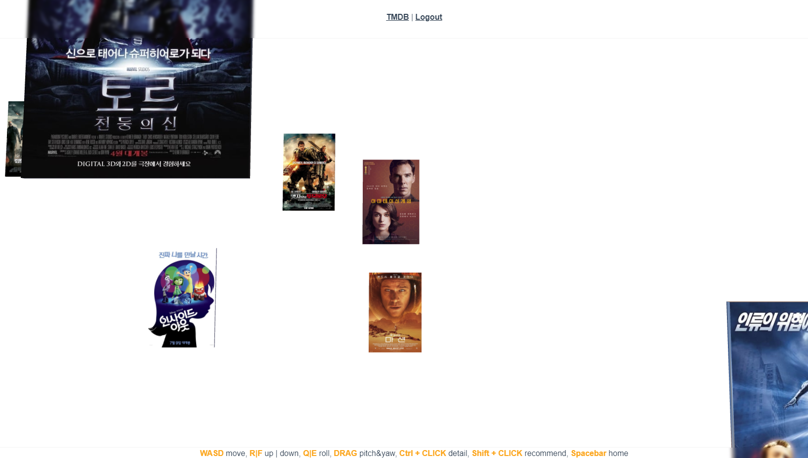

# Final Project 

> SSAFY Final pjt 관통 프로젝트

| 역할 | 팀원 이름 |                          업무 분담                           |
| :--: | :-------: | :----------------------------------------------------------: |
| 팀장 |  곽호근   | recommend 3D page 구현<br />영화 Poster 카드 제작<br />Card Texture에 영화 데이터 매핑<br />card 배치 조정<br />card 관련 추천 영화 데이터 매핑<br />자식 - 부모 카드 위치 설정<br />후처리 post-processing<br />스타일링<br />배포 |
| 팀원 |  정훈규   | DB 모델 구축<br />Account 인증 기능 구현<br />영화 검색 기능 구현<br />영화 선택 페이지 구현<br /> 영화 상세페이지 구현<br />게시글 CRUD 구현<br />댓글 CRUD 구현 |


## 1. 느낀 점

### 1.1. 처음 해보는 장기 팀 프로젝트 경험 !!

일주일이라는 기간 동안 한 프로젝트에 온전히 몰두할 수 있는 좋은 경험이었다.

제일 처음에 시간 배분과 목표 설정부터 이전과는 달랐다.

다행히 이번 파트너와는 전체적인 계획을 잡는 것도 빠르게 마쳤고, 목표했던 바도 거의 다 이룰 수 있었다.

하지만 항상 이렇게 잘 끝마칠 수는 없을 것이다.

일정대로 잘 흘러가고 있다고 느끼면서도 한쪽으로는 조바심이 나고, 밤까지 오버페이스를 하는 경우도 종종 있었다.

프로젝트 기간이 더 길어진다면 이런 관리 능력이 더 요구될 것이다.

아직은 이 부분에서 잘 준비되었는지는 모르겠다.

부족한 점이 많은 나에게 최대한 맞춰준 우리 훈규에게 박수를.. :clap: :clap: :clap: ​


### 1.2. 배포를 해보았다. 처음으로 프론트와 백엔드를 나눠서 !!

이전에 토이 프로젝트로 백엔드 따로, 프론트엔드 따로 배포해본 경험은 있지만, 이번에는 둘을 배포해서 서로 연동되게끔 했다.

몰랐을 때는 프론트엔드와 백엔드가 하나의 도메인으로 배포되는 줄 알았건만 이렇게 구성되고 있었을 줄이야.

생각보다 별거없다고 느껴지기도 하고, 어쩌면 당연한건가 싶기도 하다.

아직 배포에 대해서는 잘 모르니 점점 연습을 해서 AWS로 배포하는 개발자가 되고 싶다.


### 1.3. oh my three.js

재밌었다.

3D 는 워낙 익숙하니까 three.js 도 그렇겠지라고 접근했었는데, 뭐 반은 맞고 반은 틀렸더라.

그래도 원하는 내용 잘 구현했으니 좋다.

좀더 커스터마이징된 기능을 구현하기 위해서는 훨씬 깊은 공부가 필요함을 느꼈다.

아직은 다른 사람의 예제를 짜맞추는 느낌.


## 2. 프로젝트 구조

## 2.1 Django Rest Framework (Back-end)

### 2.1.1 ERD


### 2.1.2 accounts

```python
from rest_framework import status
from rest_framework.decorators import api_view
from rest_framework.response import Response
from .serializers import UserSerializer

# 회원가입
@api_view(['POST'])
def signup(request):
    password = request.data.get('password')
    password_confirmation = request.data.get('passwordConfirmation')
		
    if password != password_confirmation:
        return Response({'error': '비밀번호가 일치하지 않습니다.'}, status=status.HTTP_400_BAD_REQUEST)
		
    serializer = UserSerializer(data=request.data)
    
    if serializer.is_valid(raise_exception=True):
        user = serializer.save()
        user.set_password(request.data.get('password'))
        user.save()
        return Response(serializer.data, status=status.HTTP_201_CREATED)
```


### 2.1.3 community

```python
from .models import Movie, Review, Comment
from .serializers import ReviewSerializer, CommentSerializer

from django.shortcuts import render, get_object_or_404
from django.db.models import Prefetch

from rest_framework import status
from rest_framework.response import Response
from rest_framework.decorators import api_view

# JWT 관련
from rest_framework.decorators import authentication_classes, permission_classes
from rest_framework_jwt.authentication import JSONWebTokenAuthentication
from rest_framework.permissions import IsAuthenticated


# 리뷰 작성
# 리뷰 조회는 front에서 처리
@api_view(['POST'])
@authentication_classes([JSONWebTokenAuthentication]) # JWT가 유효한지 여부를 판단
@permission_classes([IsAuthenticated]) # 인증 여부를 확인
def review_create(request, movie_pk):

    movie = Movie.objects.get(pk=movie_pk)
    serializer = ReviewSerializer(data=request.data)

    if serializer.is_valid(raise_exception=True):
        serializer.save(movie=movie, user=request.user)
        return Response(serializer.data, status=status.HTTP_201_CREATED)


# 리뷰 수정 / 삭제
@api_view(['PUT', 'DELETE'])
@authentication_classes([JSONWebTokenAuthentication])
@permission_classes([IsAuthenticated])
def review_delete_update(request, review_pk):

    if not request.user.user_reviews.filter(pk=review_pk).exists():
        return Response({ 'detail': '수정/삭제 권한이 없습니다.' }, status=status.HTTP_403_FORBIDDEN)

    review = get_object_or_404(Review, pk=review_pk)

    if request.method == 'DELETE':
        review.delete()
        return Response(status=status.HTTP_204_NO_CONTENT)

    elif request.method == 'PUT':
        serializer = ReviewSerializer(review, data=request.data)

        if serializer.is_valid(raise_exception=True):
            serializer.save()
            return Response(serializer.data, status=status.HTTP_202_ACCEPTED)


# 댓글 작성
# 리뷰와 동일하게 조회는 front에서 처리
@api_view(['POST'])
@authentication_classes([JSONWebTokenAuthentication])
@permission_classes([IsAuthenticated]) 
def comment_create(request, review_pk):

    review = Review.objects.get(pk=review_pk)
    serializer = CommentSerializer(data=request.data)

    if serializer.is_valid(raise_exception=True):
        serializer.save(review=review, user=request.user)
        return Response(serializer.data, status=status.HTTP_201_CREATED)


# 댓글 수정 / 삭제
@api_view(['PUT', 'DELETE'])
@authentication_classes([JSONWebTokenAuthentication])
@permission_classes([IsAuthenticated])
def comment_delete_update(request, review_pk, comment_pk):
    
    if not request.user.user_comments.filter(pk=comment_pk).exists():
        return Response({'detail': '수정/삭제 권한이 없습니다.'}, status=status.HTTP_403_FORBIDDEN)
    
    comment = get_object_or_404(Comment, pk=comment_pk)

    if request.method == 'DELETE':
        comment.delete()
        return Response(status=status.HTTP_204_NO_CONTENT)

    elif request.method == 'PUT':
        serializer = CommentSerializer(comment, data=request.data)

        if serializer.is_valid(raise_exception=True):
            serializer.save()
            return Response(serializer.data, status=status.HTTP_202_ACCEPTED)
```


### 2.1.4 movies

```python
from operator import imod
from .models import Movie
from .serializers import MovieSerializer
from community.models import Review, Comment
from community.serializers import ReviewSerializer

from django.shortcuts import render, get_object_or_404
from django.db.models import Prefetch

from rest_framework import status
from rest_framework.response import Response
from rest_framework.decorators import api_view

from decouple import config


#.env에서 불러오기
TMDB_API_KEY = config('TMDB_API_KEY')


# DB에서 불러온 영화 정보가 DB에 없는 경우 DB에 저장
@api_view(['POST'])
def movie_create(request):

    movie_id = request.data.get('id')
    movie = Movie.objects.filter(movie_id=movie_id)

    if not movie.exists():
        movie_data = {
            'movie_id': movie_id,
            'title': request.data.get('title'),
            'overview': request.data.get('overview'),
            'release_date': request.data.get('release_date'),
            'poster_path': request.data.get('poster_path'),
        }
        
        serializer = MovieSerializer(data=movie_data)
        if serializer.is_valid(raise_exception=True):
            serializer.save()
            return Response(serializer.data)

    else:

        try:
            reviews = Review.objects.select_related('user')
            comments = Comment.objects.select_related('user')

            movie = Movie.objects.prefetch_related(
                Prefetch('reviews', queryset=reviews),
                Prefetch('reviews__comments', queryset=comments)
                ).get(pk=movie[0].pk)

        except:
            return Response(status=status.HTTP_404_NOT_FOUND)

        serializer = MovieSerializer(movie)
        return Response(serializer.data, status=status.HTTP_200_OK)
```

- DB에 50개의 기본 정보가 없는 이유?

  - tmdb DB에서 영화데이터가 없는 경우에 즉각적으로 데이터를 받아오므로 기본 정보를 보유하고 있을 이유가 없기 때문에 저장하지 않았습니다.

    

## 2.2 Vue.js (Front-end)

### 2.2.1 초기 화면


초기 화면에서 3개의 영화를 검색을 통해 tmdb DB에서 선택할 수 있다.


이때 검색하면 영화의 포스터를 클릭함으로써 영화 선택이 가능하다.


영화 3개를 선택하면 추천 페이지 이동 버튼이 보이게 된다.


### 2.2.2 Signup


회원가입 버튼을 누르면 자동적으로 로그인 페이지로 넘어간다.


### 2.2.3 Login


로그인을 하면 초기 화면으로 넘어가면서 라우터로 이동할 수 있는 컴포넌트가 

​	TMDB / Signup / Login => TMDB / Logout

로 바뀐다.


### 2.2.4 Recommend


앞서 선택한 3개의 영화를 기반으로 추천 영화들을 뒷편에 3등분을 하여 해당 위치에 관련 추천 영화 카드를 보여준다. 

이동은 키보드와 마우스를 통해 가능하며 아래를 보면 이동 방법과 상세 페이지, 홈키 등 기능 키에 대한 설명이 첨부되어 있다.




또한 뒷편으로 이동해서 추천 영화를 클릭하게 되면 클릭한 영화의 추천 영화들이 그 뒷편에 연속적으로 나온다.


### 2.2.5 상세 페이지


추천 페이지에서 ctrl +  클릭을 통해 확인이 가능하며 영화 포스터 및 등록일,평점 그리고 줄거리 등을 확인 가능하다.

또한 게시글과 댓글을 로그인 한 경우 작성,조회,수정 및 삭제가 가능하다.


## 3. threejs

### 3.1. three.js 란?


three.js 는 이름에 힌트가 있듯 3차원 공간을 표현하기 위한 JavaScript 3D library 로, WebGL 에 기반한다.

2D 라는 제한된 화면을 넘어 우리가 사는 세계 같은 3D 를 만들어낼 준비가 되었는가?


three.js 는 3D 를 다루기 때문에 다른 JavaScript 에서는 볼 수 없는 요소들이 등장한다.

가장 크게 3가지 요소로 나눌 수 있는데,

먼저, 3D 객체들로 구성된 Scene 이 있다.

그리고 Scene 을 관찰할 수 있는 Camera 가 있다.

마지막으로 Camera 로 관찰한 Scene 을 출력해주는 Renderer 가 있다.


Scene 에 대해 좀더 설명하자면,

볼륨을 나타내는 Geometry 가 있다. (Plane 과 같은 녀석들도 있으니 볼륨 이라는 말은 살짝 틀렸다.)

Geometry 를 감싸는 Material 이 있다.

그리고 Material 에 그래픽적인 무늬를 넣어주는 Texture 가 있다.

Geometry 와 Material 을 합치면 Scene 에 직접 넣을 수 있는 Mesh 가 된다.

이외에 Light, Shader 등이 있다.


끝으로 3D 의 꽃인 애니메이션이 있다.

기본적으로 Renderer 는 한 컷만을 촬영한다.

그러나 웹 사용자가 상호작용해야 하기 때문에 연속적인 촬영이 필요한데, 

이것을 도와주는 것이 requestAnimationFrame() 이다.

three.js 에서는 이 함수를 재귀적으로 구성해서 연속적으로 작동하도록 한다.

재귀적이지만 setTimeout() 처럼 비동기로 작동하기 때문에 중간중간 사용자의 인풋이나 이벤트를 감지할 수 있다.


### 3.2. 본 프로젝트에서의 구현

코드를 일일이 다루기보다는 큰 흐름을 공유하고자 한다.

자세한 내용은 실제 작성된 코드를 주석과 함께 확인하자.

``` 
// three.js 초기화
function init () {
	씬 생성
	카메라 생성 및 씬에 추가
	렌더러 생성
	
	DOM에 렌더러 추가해서 출력
	
	씬에 조명 추가
	씬에 메쉬 추가
	
  // 컨트롤러는 3D 공간에서 움직일 수 있게 해준다.
	씬에 컨트롤러 추가
	
	animate()
}

// three.js 애니메이션 생성
function animate () {
	requestAnimationFrame( animate )
}
```


### 3.3. 관련된 특이사항 - 라우트(route) 이동 제한

작은 양의 데이터야 localStorage 를 이용해 브라우저에 저장해두면 새로고침과 상관없이 출력을 유지할 수 있다.

하지만 많은 양의 메쉬가 추가된 three.js 의 Scene 은 .stringify() 할 경우 길이가 1억줄이 가뿐히 넘는다.

이는 localStorage 에 저장가능한 데이터 사이즈를 초과한다.

결과적으로 다른 라우트에 방문해야 하는 경우에는 three.js Scene 을 초기화해야 한다.

localStorage 외에 다른 방법이 있을지 모르겠지만, 우리는 데이터를 저장할 방법을 찾는 대신 라우트를 하지 않는 더 간단한 방법을 선택했다.

영화 추천 페이지에서 영화 디테일 페이지를 누르면, 페이지 라우트가 되는 것이 아니라 모달 창이 팝업된다.

모달 창 뒤의 three.js Scene 은 유지되기 때문에 데이터가 날아갈 일이 없다.


## 4. 개발환경

1. 언어
   - Python 3. 8
   - Django 3.X
   - Node 14.X
   - Vue.js 2.+
   - three.js 0.218.0
2. 도구
   - vsCode
   - ChromeBrower
   - WebGL
3. 아키텍쳐
   - Django & Vanlia JS
   - Django REST API 서버 & Vue.js
4. 라이브러리
   - three.js


Fin.